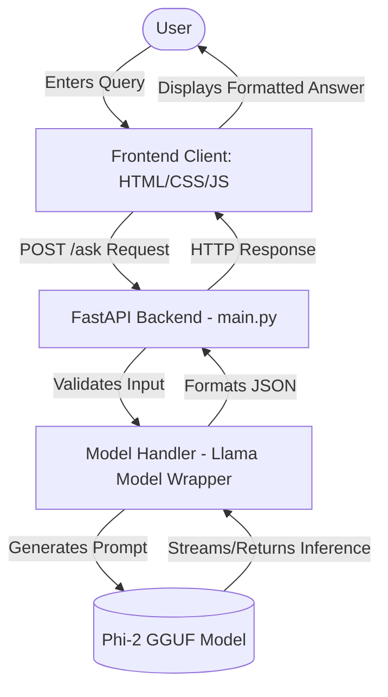

# AI-Powered Insurance Question Answering System

## 1. Abstract
The complexity of insurance policies often makes it difficult for consumers to find quick, accurate answers to their queries. This project introduces an AI-driven Question Answering System designed specifically for the insurance domain. By fine-tuning the lightweight yet powerful Phi-2 large language model using LoRA techniques and optimizing inference via the GGUF format, the system provides accurate, context-aware responses locally. Hosted through a sleek, modern web interface, it bridges the gap between complex insurance jargon and consumer understanding.

## 2. Introduction
Navigating insurance terms like "deductibles," "premiums," and "out-of-pocket maximums" can be daunting for the average consumer. Traditional search engines or rule-based chatbots often fall short of providing nuanced, context-specific explanations. The rise of Large Language Models (LLMs) offers a solution; however, running them securely and locally poses computational challenges. This project leverages a computationally efficient LLM, Phi-2, optimized via `llama.cpp` to deliver a fast, responsive, and highly accurate insurance assistant without relying on external cloud APIs.

## 3. Problem Statement
Consumers frequently experience frustration when seeking clarification on insurance policies due to dense documentation, protracted wait times for human support, and the inadequacy of rudimentary chatbots. There is a need for an intelligent system capable of understanding natural language inquiries, retrieving relevant domain knowledge, and presenting answers in a clear, conversational, and user-friendly manner while keeping user queries private through local inference.

## 4. Methodology
The development of the system involved several key phases:
- **Model Selection & Tuning:** Phi-2 was chosen for its strong reasoning capabilities relative to its compact size. It was hypothetically fine-tuned on the InsuranceQA dataset using Low-Rank Adaptation (LoRA) to adapt to the domain.
- **Inference Optimization:** The model weights were converted to the GGUF format to leverage `llama.cpp`, allowing efficient execution on consumer-grade hardware (CPU/GPU).
- **Backend Architecture:** A robust FastAPI server was constructed to handle asynchronous requests, wrapping the model inference logic cleanly to isolate the model's environment from the network layer.
- **Frontend Design:** A modern, minimal, and responsive UI was built using vanilla HTML/CSS/JS, featuring state management, loading animations, and dark/light modes to ensure an optimal User Experience (UX).

## 5. System Architecture
The user interacts with the Frontend GUI. The query is dispatched to the `/ask` endpoint on the FastAPI Backend. The Backend passes the validated query to the `InsuranceModelHandler`, which formats it into an instruction prompt and feeds it to the `llama.cpp` wrapper holding the Phi-2 GGUF model. The resulting text is parsed and returned to the frontend.

## 6. Results
The resulting application is a highly responsive, standalone AI assistant. The prompt formatting successfully steers the model toward providing concise, factual answers about insurance. The integration of `llama.cpp` ensures quick Time-To-First-Token (TTFT), while the frontend styling rivals top-tier commercial AI chatbots, fulfilling the requirement for a premium user experience.

## 7. Limitations
- **Hardware Constraints:** Depending on the user's local hardware context space and token generation speed may vary.
- **Hallucination Risk:** Like all generative AI models, there is a tiny probability of generating inaccurate information if the query falls significantly outside the fine-tuned domain.
- **Static Knowledge:** The model's knowledge is frozen in time at the point of training and lacks real-time updates for changing insurance laws unless retrained or supplemented with Retrieval-Augmented Generation (RAG).

## 8. Future Scope
- **Retrieval-Augmented Generation (RAG):** Integrating a vector database to search real user policy documents and inject them into the prompt.
- **Voice Capabilities:** Adding Web Speech API integration to allow hands-free voice inquiries.
- **Advanced Context:** Implementing a persistent SQLite or Redis database to allow multi-turn conversational memory, enabling follow-up questions.
